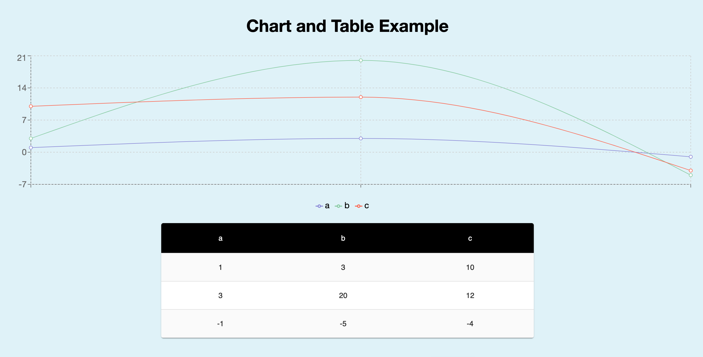

# Data Graph Example

## Setup

Clone or fork repository
cd to data-graph folder

### `npm install` 
### `npm start`

Runs the app in the development mode. 
Open [http://localhost:3000](http://localhost:3000) to view it in the browser.

